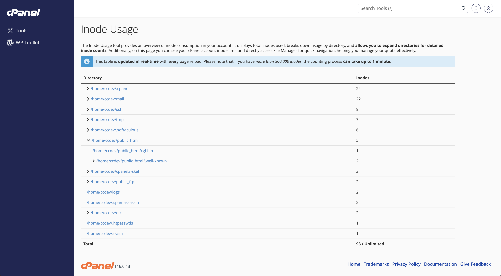

# cPanel Inode Usage Plugin

This plugin, created by [ChemiCloud.com](https://chemicloud.com) for their clients, gives a cPanel
account a directory-by-directory breakdown of its inode usage. It adds an **Inode Usage** icon to the
Files group in cPanel, shows the account's total and its inode limit, lists the home directory's
top-level directories sorted by inode count, and lets each one be expanded to drill down. It is a
read-only reporting tool: it never deletes, moves, or modifies a customer's files.



**Version 2.0.0 is the first public release.** The version number starts at 2.0.0 deliberately — see
[Why the history starts at 2.0.0](#why-the-history-starts-at-200).

## How it works

Two pieces, and no PHP:

```
/usr/local/cpanel/base/frontend/<theme>/inode_usage/index.html.tt   the page (Template Toolkit)
/usr/local/cpanel/Cpanel/API/ChemiCloudInodeUsage.pm                the data (custom UAPI module)
```

The page is a Template Toolkit template. cPanel renders it with the same chrome, header, footer and
theme assets as its own pages, and it is served by cpsrvd directly. The page's JavaScript then calls
the plugin's own UAPI module over cPanel's standard `/execute/` endpoint, exactly the way cPanel's
own front-end code calls `Quota` or `Fileman`. The module runs as the cPanel user — not as root —
so it can only ever see what that user could already see from their own shell.

**There is no `.live.php` and no `.live.pl` handler, and that is the single most important design
decision in this release.** To serve any `.live.*` page, cPanel first creates a unix socket inside
the user's home directory, before the handler ever runs. When an account is out of disk quota or at
its inode limit, that socket cannot be created and the request fails — with an HTTP 500 from a PHP
handler, or an HTTP 200 whose entire body is
`[A fatal error or timeout occurred while processing this directive.]` from a Perl one. That is
precisely the moment a customer opens an inode usage tool. A Template Toolkit page plus a UAPI
module has no such step, and both were measured rendering and returning correct data on an account
that was over quota.

### Counting

- **The account total and the inode limit** come from the quota system — `Cpanel::Quota::
  displayquota`, the same call behind cPanel's own `Quota::get_quota_info`, served from the
  per-user quota cache in `~/.cpanel/datastore` or, on a cache miss, live quota syscalls. It is
  O(1) and it is the number cPanel's sidebar shows, so the two can no
  longer disagree. A limit of 0 is reported as `Unlimited`. If the quota lookup is unavailable (quotas
  off on the filesystem, or the datastore cache cannot be written), the Total falls back to the walked
  home subtotal **and says so on the page** rather than silently showing a different number.
- **The per-directory counts** come from one iterative walk of the home directory that accumulates
  a recursive subtotal for every directory at every depth in a single pass. When the resulting map
  is small enough to ship with the response (25,000 rows), expanding a folder in the UI is a
  client-side lookup and triggers no further scanning; above that, an expansion falls back to a
  per-directory API call that re-walks that subtree under the same budget and lock.
- Only `lstat` is used. Symlinks are never followed, for counting or for descent, and each directory
  entry counts as exactly one inode. Hard links are de-duplicated by `(device, inode)`. Device
  boundaries are not crossed.
- **Ownership filtering**: an entry is counted only when its owner matches the account's UID.
  Files another user has placed in the home directory are not charged to the account. On the test
  account this correctly excluded 50 `nobody`-owned inodes. The rule applies to a directory's own
  inode too, so a directory the account does not own contributes 0 rather than 1 — which is what
  keeps a row's number equal to what that row contributes to its parent.
- **Only the largest 5,000 subdirectories of any one directory are listed.** The rest are still
  counted, and the number left out is reported and shown. Without this, a home with 200,000
  immediate subdirectories — legal under a 250,000 inode limit, and fast enough to trip neither the
  time budget nor the entry ceiling — would produce a ~45 MB response and 200,000 table rows.
- Directories the account cannot read are skipped silently rather than aborting the scan.

Because the total comes from the quota system and the rows come from the walk, the two are measuring
slightly different things: the rows cover directories, the quota figure also counts loose files and
symlinks sitting directly in the home directory, plus anything the ownership filter excluded. On the
test account the 15 top-level rows summed to 3,025 against a quota figure of 3,085. The Total label
therefore shows both numbers rather than pretending the difference does not exist.

## What's new in 2.2.0

- **The installed version shows next to the page title.** The page reads the `VERSION` marker the
  installer writes beside it and renders it as small text in the page heading, so anyone can
  compare an install against the newest release here and see at a glance that it is outdated. The
  value reflects what is actually deployed — a hand-copied install without the marker simply shows
  no version — and the page still makes no outbound requests.

## What's new in 2.1.0

- **Standalone installs work again.** The 2.0.0 installer passed a nonexistent `--no-absolute-names`
  option to tar, so the `bash <(curl …)` path always failed at extraction — after a successful
  download and checksum pass — with exit 8. Checkout installs (`git clone` + `./install.sh`) were
  unaffected. If you tried the one-liner on 2.0.0 and it died complaining it could not extract the
  release asset, this was why.
- **The wall-clock budget is 120 seconds, up from 25.** Accounts above 500,000 inodes were hitting
  the old budget and rendering partial results. The budget remains a compiled ceiling that API
  clients can lower but never raise.
- **Inodes outside the home directory get their own labelled row.** The quota Total counts
  everything the account's uid owns anywhere on the filesystem — including, say, a backup or
  staging workspace outside the home — while the table rows only ever cover the home. That
  difference now appears as its own row above the Total instead of being left for the customer to
  puzzle over. The row appears only when the quota figure is available and the walk completed, so
  a truncated walk can never inflate it.
- Reloading the page while an abandoned scan still holds the per-account lock now waits out the
  full walk (up to ~2 minutes) instead of giving up after ~9 seconds.
- A drill-down response that arrived after its folder was already collapsed no longer installs a
  permanent "Partial results" banner over rows that were never shown.

## What v2.0.0 fixes

Everything below was a real, reproducible defect in the code that has been running on production
servers, installed from the pre-release vendor tarball.

1. **It no longer crashes on directories it cannot read.** The old code died outright the moment the
   walk reached a `nobody`-owned LiteSpeed cache directory inside the account's home, which is
   common. The page simply failed. Unreadable directories are now skipped.
2. **Path containment on the drill-down.** The old endpoint took an absolute directory path in a
   query parameter and listed it, with no check that the path was inside the requesting account's
   home directory. It ran with that user's own privileges, so it granted no read access the user did
   not already have from a shell — but on a shared server it was a convenient enumerator for paths
   outside the home directory. The drill-down now takes a **home-relative** path; the base is derived
   server-side from the account's own home directory and is never taken from the client. The joined
   path is resolved and must land on the home directory or inside it. Anything outside, anything
   nonexistent, and anything unreadable get the *same* empty response, so the endpoint cannot be used
   to test whether a path exists.
3. **The timeouts are gone.** The old page walked the tree roughly twice per load — once for the
   rows and once again for the account total. The total is now a quota lookup, and the rows come from
   a single pass. On a 274,011-inode account the single-pass walk measured 2.2–5.5 seconds of CPU
   depending on the strategy benchmarked, and computing subtotals for *every* depth rather than only
   the top level cost about 1.25× the depth-1 walk. There is also a wall-clock budget — 25 seconds
   in 2.0.0, 120 seconds since 2.1.0: if it is exceeded, the partial result is returned with a
   `truncated` flag rather than the request hanging or dying.
4. **It works for over-quota accounts.** See [How it works](#how-it-works). No `.live.*` handler can
   serve this page at all when the account is at its limit; this one was measured working both under
   and over quota.
5. **Directory names are rendered literally, never as markup.** Rows are built with
   `createElement`/`textContent`. A directory named `x&"test` renders as
   that string.
6. **The scan throttles itself.** cpsrvd does not run inside LVE or CageFS, so nothing else on the
   server limits this walk. It lowers its own scheduling priority (`nice 19`), and when a batch of
   directory reads is slow enough to mean it is hitting the disk rather than the cache, it pauses for
   a fraction of that time before continuing. It also sets an idle I/O priority — worth knowing that
   this one is only honoured by the BFQ and CFQ I/O schedulers and is ignored under the `blk-mq`
   `none` scheduler most servers now use, which is why the pause exists. A per-account lock means one
   account cannot start several concurrent walks, and one process performs at most one walk, so a
   batched API request cannot multiply the cost.
7. **Smaller fixes**: the chevron reverts when an expansion fails instead of staying open;
   expanded levels sort by inode count descending, matching the top level, instead of ascending;
   clicking a folder twice while it is still loading no longer inserts a duplicate set of rows that
   can never be collapsed, and collapsing a folder while one of its children is loading no longer
   raises a JavaScript error dialog; responses carry correct content types; the page carries
   accessibility attributes; the File Manager deep link is a relative URL rather than one built from
   a client-supplied `Host` header or a hardcoded `:2083`, so it works behind a proxy.

## Requirements

- A cPanel & WHM server, with **root**. The installer registers a plugin server-wide; there is no
  per-account installation.
- The **Jupiter** theme, which is the tested target. The installer resolves the default theme from
  `DEFMOD` in `/etc/wwwacct.conf` and accepts `--theme=NAME` for anything else.
- Nothing else. No PHP, no daemon, no cron entry, no service restart. The plugin runs on the Perl
  interpreter cPanel already ships at `/usr/local/cpanel/3rdparty/bin/perl` and the Template Toolkit
  renderer cPanel already uses for its own pages.

## Installation

### Recommended: clone the tag, read it, run it

```bash
git clone --branch v2.2.0 --depth 1 https://github.com/dragosboro/cPanel-Inodes-Usage
sudo ./cPanel-Inodes-Usage/install.sh
```

Everything that gets installed is sitting in the checkout in front of you, the tag pins exactly what
you reviewed, and the installer copies from that local tree — it downloads nothing.

Add `--dry-run` first to see the full list of actions without changing anything:

```bash
sudo ./cPanel-Inodes-Usage/install.sh --dry-run
```

### Convenience: tag-pinned one-liner

```bash
sudo bash <(curl -fsSL https://raw.githubusercontent.com/dragosboro/cPanel-Inodes-Usage/v2.2.0/install.sh)
```

Understand the trade-off: **you are executing remote code as root, and GitHub's TLS certificate is
the only thing standing between you and whatever that URL returns.** You have not read the script you
are running. Run it only if that is acceptable on the box in question.

Use `curl -fsSL`, not `curl -s`: without `-f`, curl prints the server's HTML error body on a 404 and
exits 0, so `bash` is handed a web page instead of a script. And the URL is pinned to the `v2.2.0`
tag, not to `main`, because a `main`-pinned one-liner re-fetches whatever was pushed most recently.

Run this way the installer has no local payload, so it downloads the release tarball from that tag's
GitHub release and checks its SHA256 against a value embedded in the script before unpacking
anything. If that value has not been substituted at tag time, the installer exits 8 without
downloading — it will not fetch unverified code as root.

### What gets installed

| Path | Contents | Owner / mode |
| --- | --- | --- |
| `/usr/local/cpanel/base/frontend/<theme>/inode_usage/` | application directory | `root:root 0755` |
| `└─ index.html.tt` | the page | `root:root 0644` |
| `└─ preloader.gif` | loading animation the page references relatively | `root:root 0644` |
| `└─ VERSION` | version marker, so an installed copy identifies itself | `root:root 0644` |
| `/usr/local/cpanel/Cpanel/API/ChemiCloudInodeUsage.pm` | the UAPI module | `root:root 0644` |
| `/usr/local/cpanel/base/frontend/<theme>/assets/application_icons/inode_usage.svg` | menu icon (the exact subdirectory is read from the theme's own `config.json`) | `root:root 0644` |
| `/usr/local/cpanel/base/frontend/<theme>/dynamicui/dynamicui_inode_usage.conf` | menu entry, written by cPanel's `install_plugin` | cPanel-managed |

The UAPI module is the one file that lands outside the theme directory. Mode `0644` is load-bearing,
not cosmetic: the module is read and compiled by the cPanel *user's* process, so it must be
world-readable, and it must not be executable or writable by anyone but root.

Registration is delegated to `/usr/local/cpanel/scripts/install_plugin`, and the icon sprite sheet is
rebuilt with `/usr/local/cpanel/bin/sprite_generator`. The installer does not write to `/home`, does
not touch any user's `.cpanel/caches/` (writing into the `dynamicui/` drop-in directory invalidates
those caches by itself), and never edits the single `cpanelsync`-managed `dynamicui.conf` file, which
cPanel updates overwrite.

On install — and only on install — the installer removes `data.zip` from the theme root if it finds
one, and only if that file's size matches the pre-release artifact (43472 bytes) exactly. The theme
root is shared, so the file is identified by size, not by name: anyone else's `data.zip` is reported
and left alone. `--uninstall` never touches it, because the plugin never created it.

Every path the installer can create, modify or delete is listed under **BLAST RADIUS** in a comment
block at the top of `install.sh`.

### Verifying the install

```bash
cat /usr/local/cpanel/base/frontend/jupiter/inode_usage/VERSION
ls -l /usr/local/cpanel/base/frontend/jupiter/dynamicui/dynamicui_inode_usage.conf
ls -l /usr/local/cpanel/Cpanel/API/ChemiCloudInodeUsage.pm
```

The installer runs its own post-install verification — owner and mode on every deployed path, a
`perl -c` syntax check and a load check on the UAPI module, and confirmation that the menu entry
points at the file that was actually deployed — and exits non-zero if anything fails. A clean exit
plus a `VERSION` reading `2.2.0` means the plugin is fully in place. The page itself displays the
same version next to its title, read from that marker. Then log in as any cPanel user
and look for **Inode Usage** in the Files group.

cPanel rebuilds its UAPI catalogue asynchronously after a plugin is installed. A minute or two later
the module should also appear here, which is a useful extra confirmation but is not something the
installer waits on:

```bash
grep -o 'ChemiCloudInodeUsage' /var/cpanel/api_spec/cpanel_uapi.json
```

## Upgrading

Re-run the installer. It is idempotent: it replaces the payload in place, rewrites the version
marker, re-registers the plugin, and removes files that earlier builds shipped and this one does not.
There is no need to uninstall first.

Upgrading from a pre-release tarball install matters more than usual here. Those installs left three
PHP endpoints in the application directory, one of which is the unvalidated drill-down described
above. The installer explicitly deletes them, so after an upgrade that endpoint is gone from its old
URL rather than merely unused.

## Uninstalling

```bash
sudo ./install.sh --uninstall
```

This removes the menu entry, the icon, the whole application directory and the UAPI module, then
rebuilds the sprites. Add `--theme=NAME` if the plugin was installed into a non-default theme. No
customer data is touched — the plugin never stored any.

The uninstaller refuses to delete anything it cannot positively identify as its own. If the UAPI
module on disk is not the file this project ships, it is reported and left in place.

## Installer flags

| Flag | Effect |
| --- | --- |
| `--theme=NAME` | Install into (or uninstall from) cPanel theme `NAME`. Default: `DEFMOD` from `/etc/wwwacct.conf`. |
| `--uninstall` | Remove the menu entry, the icon, the application directory and the UAPI module. |
| `--dry-run` | Print every action that would be taken and change nothing — not even a temporary directory. |
| `--quiet` | Suppress progress output. Warnings and errors still print to stderr. |
| `--version` | Print the installer version and exit. |
| `--help`, `-h` | Print usage and exit. |

## Exit codes

Distinct, so automation can branch on them.

| Code | Meaning |
| --- | --- |
| `0` | Success. |
| `1` | Usage error — an unknown option. |
| `2` | Not run as root. |
| `3` | Not a cPanel server (`/usr/local/cpanel/version` is not readable). |
| `4` | Required cPanel tooling is missing or not executable. |
| `5` | The theme could not be resolved or is unusable — no `DEFMOD` and no `--theme`, an invalid theme name, a missing theme directory, a missing `config.json`, or a symlink where a real directory is required. |
| `6` | The payload is missing or inconsistent, or a destructive-operation precondition failed — including refusing to overwrite a UAPI module the installer did not write. Nothing has been changed when this is returned. |
| `7` | A deploy step failed: a directory or file could not be created or copied. |
| `8` | Download or checksum failure in standalone mode, including a build with no valid checksum embedded. |
| `9` | `install_plugin` failed to register the plugin. Application files are already deployed. |
| `10` | Post-install verification failed, or paths remained after `--uninstall`. |
| `11` | A required system utility is missing from `PATH`. |
| `12` | Unexpected failure — an unchecked command failed. The installer reports the line number and whether the install may be partial. |

## Self-contained

Installs before this release pulled two archives — `inode_usage.tar.gz` and `data.zip` — from a
personal domain at run time. That domain stopped serving `data.zip`, which meant the documented
installation had been silently producing a broken plugin: the icon and the menu entry were
registered, the application directory was never populated, the icon 404'd and the page did not load.

**That dependency is gone, and this repository is self-contained.** Everything the plugin needs is
committed here. The clone-and-run method downloads nothing at all. The only network fetch that
remains anywhere in the project is the optional one-liner, which downloads a single checksum-pinned
release asset from GitHub and from nowhere else. No third-party or personal domain is contacted at
install time or at run time, and the plugin makes no outbound network requests once installed.

## Known behaviour and limits

- **Very large accounts return a partial result rather than hanging.** The walk has a wall-clock
  budget — 120 seconds by default, raised from 25 in 2.1.0 because real accounts above 500,000
  inodes were hitting the old budget — and a hard ceiling on the number of entries examined. When
  either is hit the response is flagged as truncated and the page says so. The total and the limit
  are unaffected — they come from the quota system, not the walk. Anything proxying cpsrvd must
  allow a request to run that long; cPanel's stock service-subdomain proxying (Apache `Timeout
  300`) does.
- **The Total and the sum of the rows will not match exactly**, and the page shows both. See
  [Counting](#counting) for why.
- **Only one walk per account runs at a time.** A second request while a walk is in progress waits
  for the lock rather than starting a competing scan. Reloading the page mid-scan does not abandon
  the previous walk — it keeps running — so the new page waits and retries briefly before reporting
  that a scan is already in progress.
- **`featuremanager` is `false`** in `plugin/install.json`. This is deliberate: setting it to `true`
  would make the icon disappear for every existing customer whose hosting package predates the
  feature and does not have it enabled. Revisiting it needs a coordinated package change.

## cPanel updates

cPanel's `cpanelsync` removes a file during an update only when that file appeared in a *previous*
cPanel manifest; it does not scan directories and prune what it does not recognise. Third-party files
in both `base/frontend/<theme>/` and `Cpanel/API/` therefore survive `upcp`, which matches what is
observed on servers that have taken dozens of updates with this plugin installed.

The one case that would not survive is a future cPanel release shipping its own module at
`Cpanel/API/ChemiCloudInodeUsage.pm` — cPanel's file would then replace this one. The vendor-prefixed
module name exists to make that essentially impossible, and the installer refuses to install over a
path that cPanel's own manifest claims. If it ever happens anyway, the symptom is the page loading
with the table failing to populate; re-running the installer reports it.

## Why the history starts at 2.0.0

There is no public 1.x release. A 1.0.0 was prepared — a corrected version of the original PHP
implementation — and then dropped in favour of this rewrite rather than shipping an architecture that
could not serve an over-quota account. The public history therefore starts here.

The number is 2.0.0 rather than 1.0.0 because pre-release copies of the older code are installed in
the field, from the vendor tarball, and a `1.0.0` version marker would be ambiguous against them.
The installer recognises those installs and upgrades them cleanly.

## Credits and license

Created by [ChemiCloud.com](https://chemicloud.com) for their clients. Background and a walkthrough
are in the ChemiCloud blog post:
**[cPanel Inode Usage Plugin](https://chemicloud.com/blog/cpanel-inode-usage)**.

Licensed under the **GNU General Public License v3.0**. See [LICENSE](LICENSE).
