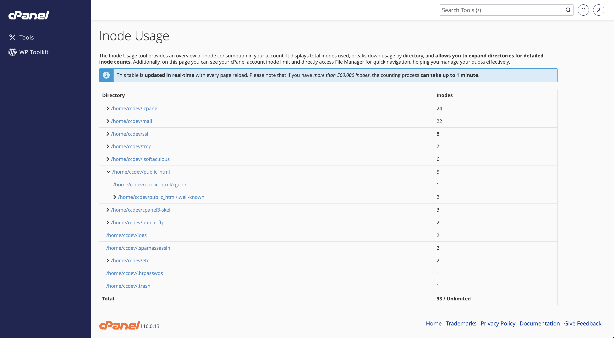

# cPanel Inode Usage Plugin

This plugin, created by [ChemiCloud.com](https://chemicloud.com) for their clients, provides real-time, detailed insights into inode usage for a cPanel account. It allows users to quickly assess their inode consumption across directories and subfolders, with inode counts updated dynamically on every page reload.

## Key Features
- **Real-Time Updates**: Unlike the default inode display in cPanel, this plugin updates inode usage in real-time with every page reload.
- **Detailed Directory Breakdown**: View inode counts for individual directories and subfolders, allowing users to identify areas consuming the most inodes.
- **Ownership Filtering**: Inodes are only counted for files and directories owned by the cPanel user, ensuring accurate usage reporting.
- **Large Directory Handling**: For accounts with more than 500,000 inodes, the counting process may take up to 1 minute, but provides a clear and complete overview of usage.

## Installation Instructions

For WGET (recommended for most cPanel servers): bash <(wget -qO- https://raw.githubusercontent.com/dragosboro/cPanel-Inodes-Usage/main/install.sh)
For CURL: bash <(curl -s https://raw.githubusercontent.com/dragosboro/cPanel-Inodes-Usage/main/install.sh)

For further installation instructions, explanations and assistance, check out the **[cPanel Inode Usage Plugin](https://chemicloud.com/blog/cpanel-inode-usage)**.
